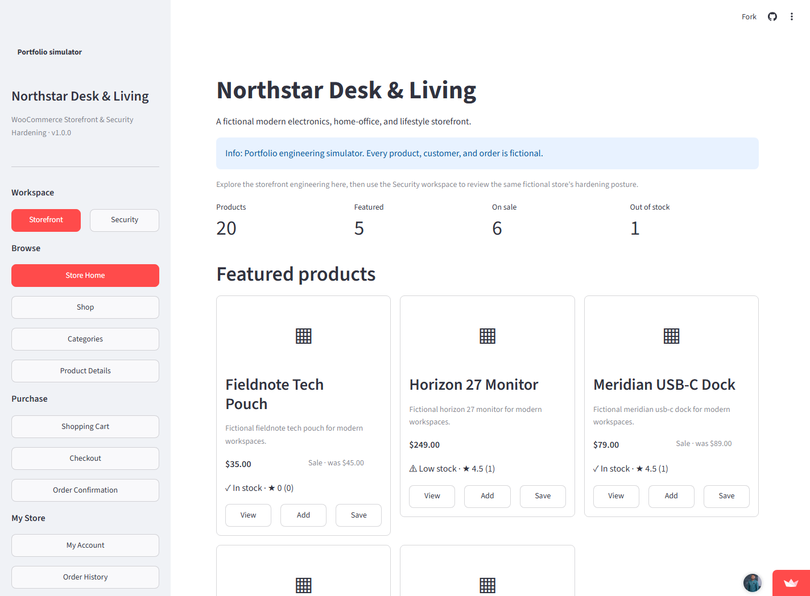
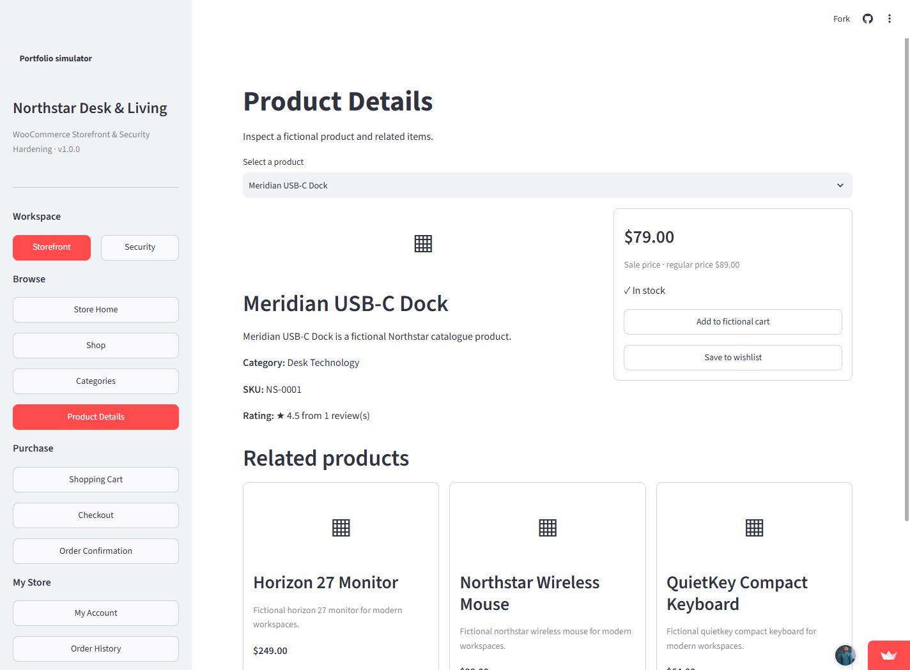
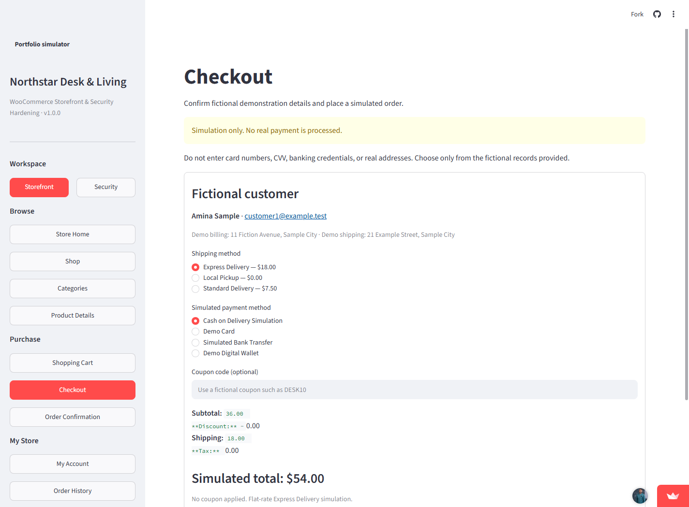
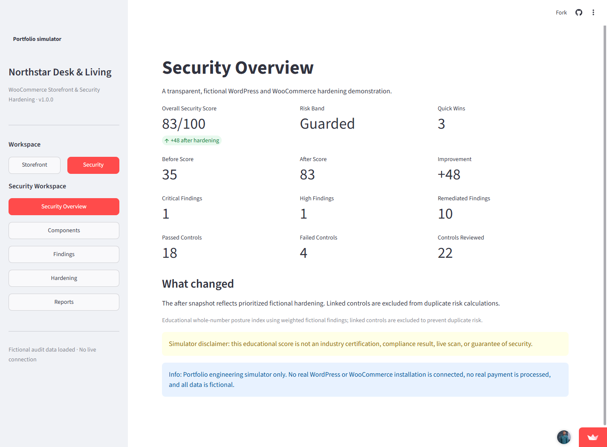

# WooCommerce Storefront & Security Hardening

**Release:** `1.0.0`  
**Storage schema:** `1`  
**Runtime:** Python 3.12+ and Streamlit

An offline-first portfolio engineering simulator that combines a realistic fictional
WooCommerce-inspired storefront with an explainable WordPress/WooCommerce security
hardening workspace.

> This is not a WordPress or WooCommerce installation, live store, vulnerability scanner,
> certification, or payment system. Northstar Desk & Living and every product, customer,
> address, order, account, activity event, and security finding are fictional. No real
> payment is processed or requested.

## Links

- **Live demo:** [Open the Streamlit application](https://woocommerce-storefront-security-hardening-p9d7t7mkrclous9etglr.streamlit.app/)
- **Source repository:** [View on GitHub](https://github.com/promiseibehdev/woocommerce-storefront-security-hardening)

## What this project demonstrates

- Layered Python architecture with domain models, validation, serialization, repositories,
  storage, application services, and a thin Streamlit presentation layer.
- Ecommerce catalogue, cart, promotion, shipping, checkout, account, order, inventory,
  and wishlist behavior using exact `Decimal` calculations.
- Deterministic WordPress/WooCommerce posture data, explainable risk scoring, component
  lifecycle review, findings, remediation planning, before/after comparison, and safe
  JSON report export.
- Privacy-safe, offline-first engineering with explicit sample loading and instance-scoped
  session state.

## Storefront

- Store Home, Shop, Categories, and Product Details
- Search plus category, stock, featured, and sale filters
- Name, price, rating, and date sorting
- Related products and accessible stock labels
- Cart quantity management and inventory limits
- Fixed and percentage coupons
- Flat-rate, free-threshold, and local-pickup shipping simulations
- Checkout validation and fictional order confirmation
- Fictional customer profiles, order history, and wishlist
- Store disclosures and hosted-state limitations

Checkout never contains card-number, CVV, bank-account, credential, or real-address input.
It selects only deterministic fictional records and repeats:

> Simulation only. No real payment is processed.

## Security workspace

- Security Overview with 35-before / 83-after educational posture scores
- WordPress Core, WooCommerce, PHP, plugin, and theme posture
- Update, lifecycle, abandoned-plugin, child-theme, and fictional risk indicators
- Searchable/filterable findings with impact and remediation
- Prioritized plan, effort, quick wins, completed work, and remaining work
- Before/after comparison
- Privacy-safe in-memory JSON report download

The score is an educational portfolio index, not a compliance result, industry
certification, live scan, or guarantee. No CVE database or live WordPress endpoint is
queried.

## Architecture

```text
Streamlit presentation
        |
Application and dashboard services
        |
Instance-scoped repositories / unit of work
        |
Domain models, validation, serialization
        |
Optional explicit atomic JSON storage
```

Business calculations stay in services. Streamlit owns only presentation and per-session
adapters. No mutable application state is cached globally.

See [Architecture](docs/ARCHITECTURE.md), [Security Methodology](docs/SECURITY_METHODOLOGY.md),
and [Testing](docs/TESTING.md).

## Project structure

```text
app.py
src/woo_security_simulator/
  domain/          # Models, enums, validation, errors
  repositories/    # In-memory repositories and unit of work
  sample_data/     # Deterministic factory and integrity checks
  services/        # Commerce, security, reporting, activity, state
  storage/         # Atomic JSON, backups, migration framework
  ui/              # Streamlit shell, storefront, security workspace
tests/             # Domain through Streamlit/startup/safety tests
docs/              # Architecture, methods, deployment, release readiness
```

## Installation

```powershell
python -m venv .venv
.\.venv\Scripts\Activate.ps1
python -m pip install --upgrade pip
python -m pip install -e ".[dev]"
```

On macOS/Linux, activate with `source .venv/bin/activate`.

## Run locally

```powershell
python -m streamlit run app.py
```

The application intentionally starts empty. Select **Load Fictional Sample Data** to
construct the deterministic Northstar dataset in memory. Loading does not write a state
file or create a backup directory.

## Testing and quality

```powershell
python -m pytest
python -m ruff check .
python -m ruff format --check .
```

The suite covers domain validation, serialization, data integrity, repositories, atomic
storage, backups/recovery, commerce/security services, session isolation, privacy,
offline/import/startup safety, every navigation destination, and Streamlit interactions.

## Offline-first and performance

- Streamlit is the only runtime dependency.
- No remote product images, fonts, APIs, analytics, trackers, or vulnerability services.
- Empty startup constructs no fixture and performs no serialization or file I/O.
- Sample data is generated once per explicit session action and reused through that
  session’s `ApplicationStateService`.
- Catalogue and security operations run over a small deterministic in-memory dataset.

## Privacy and security safeguards

- Emails use only `example.test`; site labels use reserved `.test` domains.
- No credentials, tokens, cookies, WordPress/WooCommerce keys, browser profiles, or real
  payment/customer data.
- No unsafe pickle/eval/exec deserialization.
- JSON payloads are reconstructed through declared typed models and validated before use.
- Local asset references reject remote schemes, absolute paths, and traversal.
- Optional persistence validates complete state, writes a same-directory temporary file,
  flushes/`fsync`s, and atomically replaces the destination.
- Backup restore is explicit and validates the candidate first.

## Hosted persistence warning

Streamlit Community Cloud storage may reset at any time. The released demo will remain
session-first and must never be treated as durable customer, order, or security storage.
The app needs no secrets.

## Screenshots

All images below are real captures from the verified live Streamlit deployment.









Additional live captures: [Shop](docs/screenshots/shop.png),
[Components](docs/screenshots/components.png), [Findings](docs/screenshots/findings.png),
[Hardening](docs/screenshots/hardening.png), and [Reports](docs/screenshots/reports.png).

## Deployment

The public demo deploys `app.py` from `main` to Streamlit Community Cloud using Python
3.12, no secrets, and no external application services. See
[Deployment](docs/DEPLOYMENT.md).

## Known limitations

- This is a single-session educational simulator, not production commerce.
- There is no real authentication, authorization, tax engine, gateway, fulfillment,
  inventory concurrency, WordPress runtime, scanner, or CVE feed.
- Optional JSON persistence is local and single-process; hosted state may reset.
- Streamlit controls browser semantics, focus treatment, and responsive column behavior;
  manual assistive-technology and final device checks remain part of Phase 7.
- PDF report export is intentionally absent.

## Portfolio context

This project demonstrates ecommerce domain engineering and practical security-hardening
communication in one recruiter-friendly application.

## License

Original project code and locally created abstract UI placeholders are provided under the
[MIT License](LICENSE). Streamlit and other third-party software retain their own licenses.
